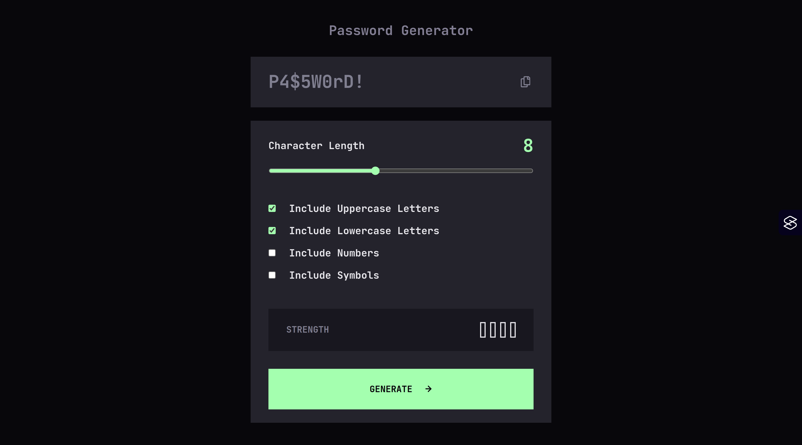

# Frontend Mentor - Password generator app solution

This is a solution to the [Password generator app challenge on Frontend Mentor](https://www.frontendmentor.io/challenges/password-generator-app-Mr8CLycqjh). Frontend Mentor challenges help you improve your coding skills by building realistic projects.

## Table of contents

- [Overview](#overview)
  - [The challenge](#the-challenge)
  - [Screenshot](#screenshot)
  - [Links](#links)
- [My process](#my-process)
  - [Built with](#built-with)
  - [What I learned](#what-i-learned)
  - [Continued development](#continued-development)
  - [Useful resources](#useful-resources)
- [Author](#author)

## Overview

### The challenge

Users should be able to:

- [x] Generate a password based on the selected inclusion options
- [x] Copy the generated password to the computer's clipboard
- [x] See a strength rating for their generated password
- [x] View the optimal layout for the interface depending on their device's screen size
- [x] See hover and focus states for all interactive elements on the page

### Screenshot



### Links

- Solution URL: [https://github.com/jkaps9/password-generator](https://github.com/jkaps9/password-generator)
- Live Site URL: [https://jkaps9.github.io/password-generator/](https://jkaps9.github.io/password-generator/)

## My process

### Built with

- Semantic HTML5 markup
- CSS custom properties
- Flexbox
- CSS Grid
- Mobile-first workflow
- [React](https://reactjs.org/) - JS library
- [Vite](https://www.google.com/search?q=https://vitejs.dev/) - Frontend Tooling
- SVGR - For importing SVGs as React components
- Web Crypto API - For secure random number generation

### What I learned

I focused heavily on performance and accessibility in this project. One major architectural decision was implementing a dynamic import for the zxcvbn password analysis library. Because the library includes a large dictionary for scoring, downloading it on the initial page load negatively impacts performance. By converting the generation function to be asynchronous and fetching the library only when needed, I kept the initial JavaScript bundle minimal and highly optimized.

```js
const generatePassword = async () => {
  // ... generation logic
  if (generated) {
    try {
      const zxcvbnModule = await import("zxcvbn");
      const zxcvbn = zxcvbnModule.default || zxcvbnModule;
      setPasswordAnalysis(zxcvbn(generated));
    } catch (err) {
      console.error("Failed to load password analysis tool", err);
      setPasswordAnalysis(null);
    }
  }
};
```

On the styling side, I utilized modern CSS features like the :has() pseudo-class to handle form validation visually. This allowed me to apply error styling to the entire parent container if any child checkbox was marked invalid, without needing complex JavaScript state for the container's class names.

```css
.input-group:has(input[type="checkbox"][aria-invalid="true"]),
input[aria-invalid="true"]::-webkit-slider-runnable-track {
  border: 1px solid var(--colors-red-500);
}
```

I also improved the screen reader experience by strategically using aria-live="polite" regions and aria-describedby to ensure users relying on assistive technologies receive immediate, accurate feedback on form errors and clipboard actions.

### Continued development

In future projects, I plan to continue refining my approach to web accessibility, specifically regarding the friction between provided UI designs and strict WCAG standards. During this challenge, I had to make calculated adjustments to text colors and contrast ratios to pass automated Lighthouse audits. I want to build a stronger eye for identifying inaccessible design choices early in the development cycle.

I also want to continue mastering advanced CSS layout techniques and modern form validation patterns in React to keep my components modular and clean.

### Useful resources

- [MDN Web Docs](https://www.google.com/search?q=https://developer.mozilla.org/en-US/docs/Web/API/Crypto/getRandomValues): Crypto.getRandomValues() - This documentation was essential for ensuring the password generation logic was cryptographically secure rather than relying on Math.random().
- [Vite Features: Dynamic Imports](https://www.google.com/search?q=https://vitejs.dev/guide/features.html%23dynamic-import) - This helped me understand how Vite handles code-splitting out of the box, which was necessary for optimizing the zxcvbn package payload.
- [Axe Accessibility Testing](https://www.google.com/search?q=https://www.deque.com/axe/) - Running automated audits helped me catch missing form labels and improper ARIA attribute usage, ensuring the final application is fully navigable by screen readers.

## Author

- Frontend Mentor - [@jkaps9](https://www.frontendmentor.io/profile/jkaps9)
